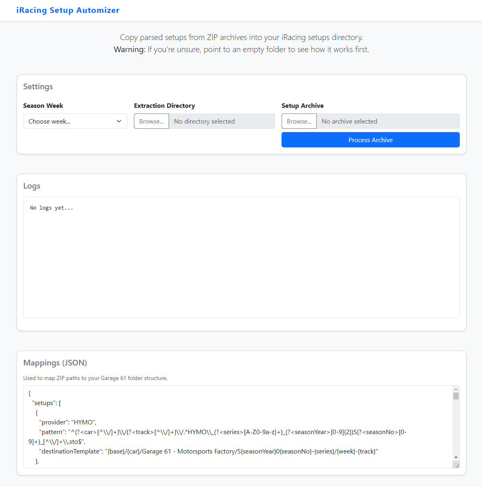
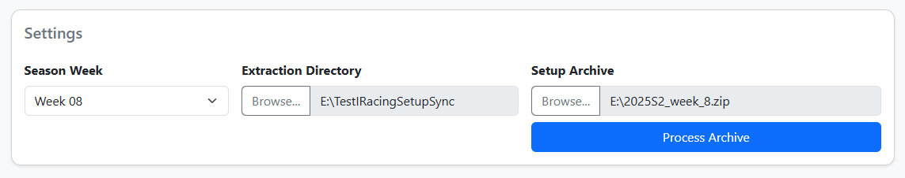
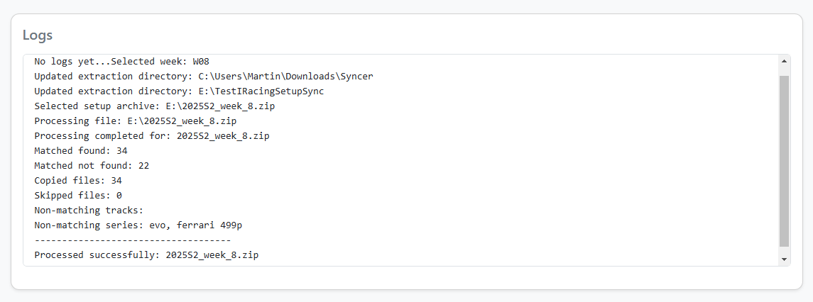

# iRacing Setup Automizer

A cross-platform desktop app (built with Electron + Javascript) that parses iRacing setup archives from different providers (HYMO, P1Doks, etc.), and automatically copies each `.sto` file into your team’s Garage 61 folder structure.

---

## 🚀 Features

- **Specify an output folder**: Specify where to drop setup files
- **Define your custom folder structure**: Move setups from providers into your custom structure
- **Flexible mappings**: Regex-based `config.json` for providers, tracks, and series
- **Interactive UI**: Select season week, extraction directory, and setup file to process
- **Live logs**: see parsing, matches, errors in real time

---

## 🖥️ Usage

1. **Download & Install**  
   - Clone or download the release (for Windows)  
   - Install per standard Electron app install instructions  

2. **Launch the App**  
   - On Windows run the installed executable  
   - You’ll see the main window:  

   

3. **Configure Settings**  
   1. **Season Week**  
      - Use the dropdown to pick the iRacing week (e.g. `W07`) for the setups.  
   2. **Extraction Directory**  
      - Click **Browse…** and choose the folder where you want setups to be copied.  
      - Choose an empty folder to try out the app without affecting your iRacing setups.  
   3. **Setup Archive**  
      - Click **Browse…** and select your `.zip` archive of setups.  
      - Click **Process Archive** to start extraction & copying.  

   

4. **Monitor Logs**  
   - The **Logs** panel shows each file processed, matches found, skips, and errors.  
   - Scroll to the bottom to follow the latest actions.  

   

5. **View / Edit Mappings**  
   - The **Mappings (JSON)** section displays your current `config.json` rules.  
   - You cannot (yet) edit this file. To edit this file, open an issue in the Github project.  

---

## 🛠️ Development

### Prerequisites

- [Node.js ≥ 16.x](https://nodejs.org/) & npm  
- [Git](https://git-scm.com/)  

### Getting Started

```bash
# 1. Clone the repo
git clone https://github.com/mjainta/iracing-setup-automizer.git
cd iracing-setup-automizer

# 2. Install dependencies
npm install

# 3. Start in development mode
npm start
```

- The app will launch with DevTools open.  
- Config is loaded from `config.json` at project root.

### Project Structure

```
|
├── main.js           # Electron main process (window, IPC, ZIP handling)
├── preload.js        # Secure bridge to renderer
├── renderer.js       # UI logic
├── services/         # config loader, matcher
├── public/
├── index.html        # Main HTML
├── assets/           # CSS, icons, screenshots…
├── config.json       # Mapping rules for providers, tracks, series
├── tests/            # Unit tests (using jest)
└── package.json
```

### Building & Packaging

```bash
# Build a distributable installer / win-unpacked
npm run dist
```

- Generates Windows-specific installers under `dist/`.  


### How to add a new special event for GnG

1. Add it to `index.html` in the select for events
2. Add it to the `config.json`
   1. New setups mapping
   2. New series in gng
   3. New series in general (both is required, gng and general, looks like tech debt)

---

## ❤️ Contributing

1. Fork this repo  
2. Create a feature branch (`git checkout -b feature/my-feature`)  
3. Commit your changes (`git commit -m "Add awesome feature"`)  
4. Push (`git push origin feature/my-feature`)  
5. Open a Pull Request

Please adhere to the existing code style and include tests where applicable.

---

## 📄 License

MIT © [mjainta]  
```
